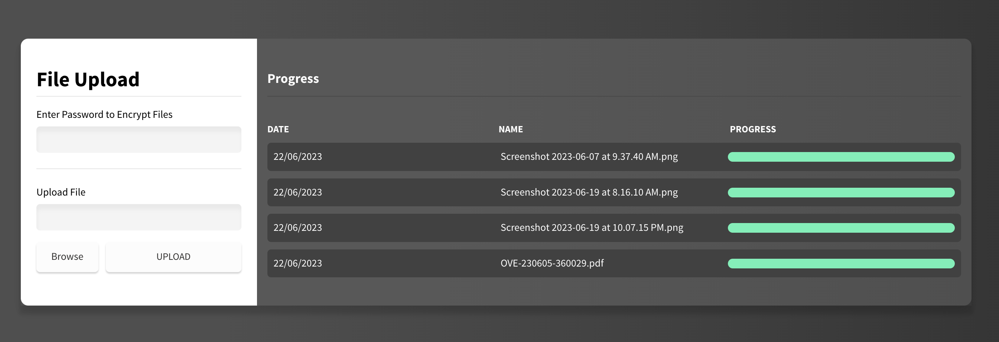

# Vanilla JS File Uploader
This file uploader app is a user-friendly tool designed to streamline the process of uploading files to a web application or server. With its intuitive interface, users can easily select and upload files from their local devices to the designated destination.

## Introduction
This app does few things offline
1. Fetch file data from JSON Server REST API
2. Users can choose files to upload by browsing their computer.
3. The uploader provides real-time feedback on the progress of file uploads, allowing users to monitor the status of their uploads
4. The uploader can be configured to validate file sizes, ensuring that only specified file sizes are allowed for upload.

## Acceptance Criteria
1. As a user, I want the file uploader to allow me to select and upload one file at a time. I expect the file upload functionality to be implemented on the client side using the HTML5 FileReader API.
2. As a user, I want the file uploader to display the progress of each file upload. I also want to receive a final confirmation when the file is successfully uploaded.
3. As a user, I want the server side to have a simple API REST interface. This interface should enable me to upload the file to a specific directory on the web server. I expect to receive a success response from the server upon completion, along with a potential status message.
4. As a user, I expect the file uploader to handle failed uploads gracefully. In case of a failed upload, I want to see an appropriate error message displayed on the user interface, indicating the reason for the failure.
5. As a user, I want the file uploader to be compatible with the latest versions of Chrome and Firefox. I expect the uploader to work seamlessly on these browsers, ensuring a smooth user experience.

## Getting Started
1. Clone or download the repository to your local machine.
2. Install the required dependencies by running`npm install` in the terminal.
3. Start the app by running `npm run dev`
4. Start the server by running `npm run server`

## Screenshot
